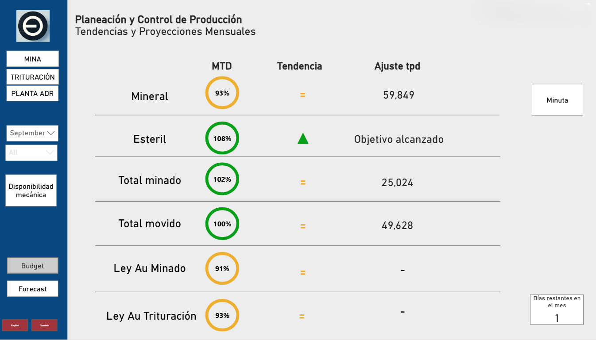

# Mining Dashboards

During my time in the Operational Excellence Department, one of my key responsibilities was to create tools that allowed the Operational Director and the Operational Excellence Team to monitor production compliance.

The challenge: **summarizing the entire operation in just a few clicks** — moving from static tables to a dynamic, interactive dashboard that executives could use daily.

---

## 1. Context & Challenges

Managers traditionally monitored daily production using **SIREP**, a corporate platform tracking tonnage, flow, grades, and consumption ratios.

**Limitations of SIREP:**

* Tabular-only data visualization.
* Only one date could be selected at a time (e.g., no direct quarter-to-quarter comparison).
* Further analysis required exporting or using on-premise tools (e.g., SCADA).

SIREP remained the **official corporate data source**, ensuring reliability but limiting usability. My role was to guarantee that reported data aligned with SIREP’s accuracy.

---

## 2. Solution & Approach

I developed a **Power BI dashboard** as an interactive reporting tool presenting SIREP’s official data with added capabilities:

* Daily updates with *to-date* calculations.
* Moving average vs. actual vs. target graphs.
* Adjusted production calculations to meet targets.
* Performance projections based on trends.
* Top-down navigation: from corporate overview down to detailed metrics.

**Tech stack:**

* **DAX** (KPIs & calculations)
* **Power Query (M)** (data shaping, pivots, weighted averages)
* **SQL** (queries to SIREP database)
* **Power BI Gateway** (automated refresh & deployment)

---

## 3. Data Sources & Processing

* Queried directly from **SIREP’s SQL database** for both actuals and targets (budget & forecast).
* Implemented **special handling for weighted averages** using Power Query transformations.
* Ensured alignment with official reporting standards.

---

## 4. Deployment

* Published to a **Power BI Workspace** with access granted to relevant users.
* Requested a **dedicated server** from IT to host the Gateway.
* Scheduled automatic refreshes **twice daily (11:30 and 12:00)**.

This ensured consistent access across departments without manual intervention.

---

## 5. Features & Functionality

### Main Page

* Filterable by month or quarter.
* Three-column executive summary:

  1. To-date compliance
  2. Trend indicators
  3. Adjustments required to meet targets

**Trend indicators**:

* ▲ Green triangle → > 5% increase vs. previous value
* ▼ Red triangle → > 5% decrease
* = Equal sign → variation within ±5%

### Drill-Down Pages

* Detailed views for **Mine, Crushing, Processing Plant, and Equipment Availability**.
* Each report page includes:

  * Line chart (actuals, 7-day moving average, target)
  * Compliance ring with cumulative compliance
  * Current moving average value
  * Projected performance if trends continue
  * Final target for the period
  * Adjustments required to reach the target

---

## 6. Final Results & Impact

* Directors and managers gained a **quick, reliable overview** of production performance.
* Simplified identification of **adjustments needed to meet goals**.
* Confidence in **data integrity** since the dashboard is fully based on the corporate source.

The scope was intentionally **executive-focused**, leaving real-time and highly detailed monitoring to operational tools like **Pi System**.

---

## 7. Related Work

👉 For real-time dashboards and process-level monitoring, see the repository on **Pi System** (*link here*).

---

